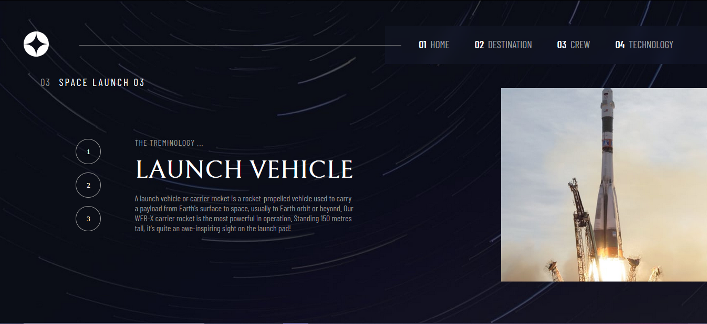

# Frontend Mentor - Space tourism website solution

This is a solution to the [Space tourism website challenge on Frontend Mentor](https://www.frontendmentor.io/challenges/space-tourism-multipage-website-gRWj1URZ3). Frontend Mentor challenges help you improve your coding skills by building realistic projects.

## Table of contents

- [Overview](#overview)
  - [The challenge](#the-challenge)
  - [Screenshot](#screenshot)
  - [Links](#links)
- [My process](#my-process)
  - [Built with](#built-with)
  - [What I learned](#what-i-learned)
- [Author](#author)

**Note: Delete this note and update the table of contents based on what sections you keep.**

## Overview

### The challenge

Users should be able to:

- View the optimal layout for each of the website's pages depending on their device's screen size
- See hover states for all interactive elements on the page
- View each page and be able to toggle between the tabs to see new information

### Screenshot





### Links

- Solution URL: [Add solution URL here](https://your-solution-url.com)
- Live Site URL: [Add live site URL here](https://spacevisit.netlify.app/technology)

## My process

### Built with

- Semantic HTML5 markup
- CSS custom properties
- Flexbox
- CSS Grid
- Mobile-first workflow
- react
- react Router

### What I learned

Dynamic Image Mapping in react by Image mapping file
Picture tag for different images in background according to different viewports

```html
<picture>
  <source media="(min-width: 1000px)" srcset="{homedesktop}" />
  <source media="(min-width: 768px)" srcset="{hometablet}" />
  
</picture>
```

## Author

- Website - [Add your name here](https://manishbishtportfolio.netlify.app/)
- Frontend Mentor - [@yourusername](https://www.frontendmentor.io/profile/ManishBisht777)
- Twitter - [@yourusername](https://twitter.com/manishbisht9711)
